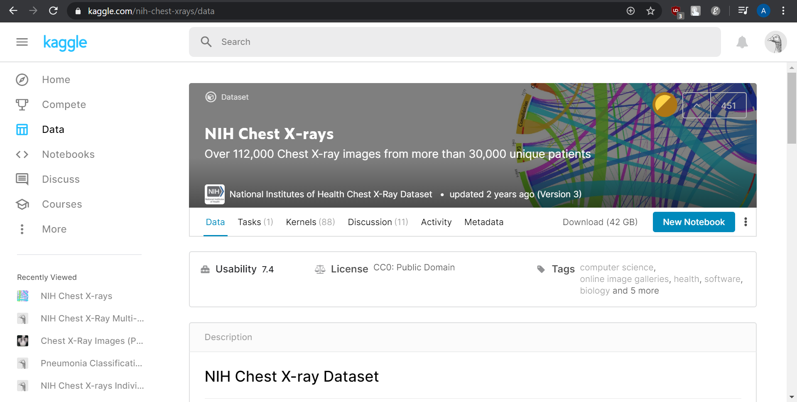
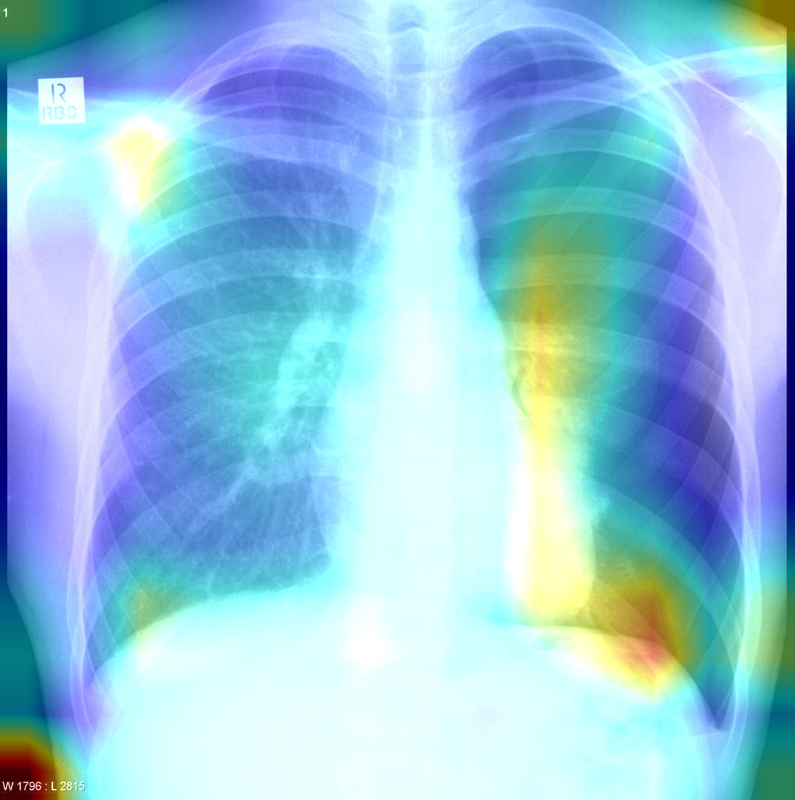

# Common Chest X-ray Classification and Localization
***
This project is about predicting and classifying chest x-rays into 10 common chest diseases using deep learning with neural networks and also its localization using the CAM and Grad-CAM to map them. This project repository is intended for my final dissertation at the University of Nottingham. 


## Prerequisites
***
Download and install the latest [Anaconda]([https://www.anaconda.com/distribution/](https://www.anaconda.com/distribution/)) according to your OS

Clone this repository, then create a virtual environment using the environment.yaml file provided
```shell
conda env create -f environment.yaml
```
To use the environment, use conda activate (on Windows) or source activate (on OSX/Linux)
```shell
conda activate dissertation_env
```

or install the packages and dependencies separately
```shell
conda create -n xray-env python=3 numpy pandas anaconda seaborn anaconda scikit-learn anaconda keras anaconda opencv
```
- Python 3.x
- Pandas 1.0.1
- Seaborn 0.10.0
- Scikit-learn 0.22.1
- Keras 2.3.1
- OpenCV 4.0.1 (64-bit OS) or 3.4.3 (32-bit OS)

## Flowtensor
***
To see the library in action, open your command line, change the directory path to the folder you just cloned, then run
```shell
python main.py
```

Creating the model can be done by
```
convolution = Convolution2D(filter_shape=(3,3), num_filters=8, padding='same', activation='relu', stride=1, kernel_init='random', debugging=False)
maxpool = MaxPool2D(pool_size=2, debugging=False)
softmax = Softmax(13*13*8, 10, activation='softmax', regularizer='l2', debugging=False)
```

Now, let's try training a model using the Flowtensor library! :)

First, open up Jupyter Notebook
```shell
jupyter notebook
```
the command above will open the Jupyter Notebook in a new tab in your browser. Then, create a new notebook (.ipynb) file with Python 3. Make sure you create the new file in the same directory with the repository you just cloned.

We are going to use a simple dataset from the fashion MNIST.
```
import numpy as np
from lib.flowtensor import Convolution2D, MaxPool2D, Softmax
from lib.utils import train, test, show_loss_graph, show_acc_graph
from tensorflow.keras.datasets import mnist, fashion_mnist

# load the dataset
(x_train, y_train), (x_test, y_test) = fashion_mnist.load_data()

# define convolution, pooling, and fully connected(dense) layers
convolution = Convolution2D(filter_shape=(3,3), num_filters=8, padding='same', activation='relu', stride=1, kernel_init='random', debugging=False)
maxpool = MaxPool2D(pool_size=2, debugging=False)
temp = convolution.conv2d(x_train[0]/255) # save img dimensions
temp = maxpool.pool(temp)
tmp_shape = temp.shape
softmax = Softmax(tmp_shape[0]*tmp_shape[1]*tmp_shape[2], 10, activation='softmax', regularizer='l2', debugging=False)

# train the model
l, a = train(convolution, maxpool, softmax, epochs=5, lr=0.01, features=x_train[:1000], labels=y_train[:1000])

# test the model
preds = test(convolution, maxpool, softmax, x_test[:1000], y_test[:1000])

# shows loss & accuracy graph
show_loss_graph(l)
show_acc_graph(a)
```

## Model Training
***

### Create Our Own Model
We can use Keras to build our own model with custom layers
```
model = Sequential()
model.add(Conv2d(filters=32, kernel_size=3, padding='same', activation='relu', input_shape=(64,64,3)))
model.add(MaxPool2D(pool_size=2))
....
model.add(Flatten())
model.add(Dense(256, activation = 'relu'))
model.add(Dropout(0.2))
model.add(Dense(len(diseases), activation = 'softmax'))

model.compile(optimizer='adam', loss='binary_crossentropy', metrics=['accuracy'])

model.fit_generator(generator=train_gen, steps_per_epoch=len(train_gen)//TRAIN_BATCH_SIZE, epochs=5, validation_data=(valid_X, valid_Y), validation_steps=len(valid_X)//VAL_BATCH_SIZE)
```

### Using Pre-trained Models
We can also use pre-trained models available from keras to start with
```
base_model = InceptionV3(include_top=False, input_shape=(224,224,3))
# freeze the base model
for layer in base_model.layers:
    layer.trainable = False
        
# adds our own dense layers
output = base_model.output
output = Flatten()(output)
output = Dense(256, activation='relu', kernel_initializer='glorot_uniform', bias_initializer='zeros', kernel_regularizer=regularizers.l2(0.01))(output)
last_output = Dense(14, activation='softmax')(output)
# construct final model
final_model = Model(base_model.input, last_output)
# compile the model
final_model.compile(optimizer='adam', loss='binary_crossentropy', metrics=['accuracy'])

final_model.fit_generator(generator=train_gen, steps_per_epoch=len(train_gen)//TRAIN_BATCH_SIZE, epochs=5, validation_data=(valid_X, valid_Y), validation_steps=len(valid_X)//VAL_BATCH_SIZE)
```

### Using Kaggle for Training (Optional)
Under 'Kaggle' directory, you can find 2 separate files. I recommend you to run these files on Kaggle ([NIH dataset]([https://www.kaggle.com/nih-chest-xrays/data](https://www.kaggle.com/nih-chest-xrays/data))). Register or sign in if you already have an account. All dataset and library has been set up for you. Create new notebook and just upload the notebook file from this repository and you are good to go.
<div align="center">
  
</div>
The most important thing in Kaggle is access to GPU computations. Just be aware of your weekly quota. Each account is only given 30 hours per week.

## Predicting and Visualizing Chest X-ray Diseases
***

We can predict an image based on the model we trained
```
pred_Y = final_model.predict(test_image)
```

### Using The App
Under the 'app' directory, there are 2 separate notebook files. Before that, make sure you already have the weights that you saved while training the model. I could not provide the weights because Github only allows 100MB max file size upload. Instead, you can download the weights [here](https://drive.google.com/open?id=1Z_PSPXI_g4QTAxxWEUs2Tk9WfdDvvh1i) and save them.
Later, you can select them when running through each cell in the notebook
```
MODEL_PATH = open_dir()
MODEL_PATH
'C:/Users/ASUS/Desktop/Archel/Nottingham/Dissertation/Source Code/Training Results/Adamax/weights/weights.VGG16.5-0.19.hdf5'
```

You should probably see the output like this
<div align="center">
  
</div>
